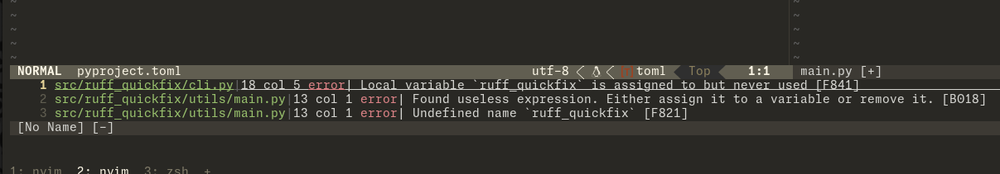

<!-- markdownlint-disable MD033 MD041 MD024 -->
<div align="center">

# ruff-quickfix

[](https://pypi.org/project/ruff-quickfix/)

[](https://python-poetry.org/)


</div>

This is a simple wrapper for the Python linter [ruff](https://github.com/astral-sh/ruff)
that allows it to be easily used with (neo)vim's quickfix.

**Why?** I like Vim's quickfix and find it more useful in some situations over
using an LSP. Also this is an excuse to learn publishing.



## Install

### [pipx](https://github.com/pypa/pipx) *(recommended)*

**Note:** Normal pip works as well, though you should give pipx a try!

* [PyPi](https://pypi.org/project/ruff-quickfix/): `pipx install ruff-quickfix`
* [GitHub](https://github.com/Nealium/ruff-quickfix): `pipx install git+https://github.com/Nealium/ruff-quickfix`
* If you don't already have ruff you include it as an "extra"
  * `pipx install ruff-quickfix[ruff]`
  * if zsh: `pipx install ruff-quickfix\[ruff\]`

### Source

Clone project: `git clone https://github.com/Nealium/ruff-quickfix.git`

* Pipx: `pipx install .`
* Pip: `pip install .`
* Poetry: `poetry install`
* From Wheel:
  * `poetry install`
  * `poetry build`
  * `pipx install dist/*.whl`

### [Home Manager](https://github.com/nix-community/home-manager) *(nix)*

**Note!** This **will** crash on the first run as the sha256 isn't *real*. Once
it crashes the error message will provide the *actual* sha256 that is required.

1. Insert items into `home.nix`
2. Replace `rev` with the most recent commit's hash
3. Run
4. Replace placeholder `sha256` with actual hash from error message
5. Re-run
6. Validate: `ruff-quickfix --help`

```nix
{ config, pkgs, ... }:
let
  # other stuff..

  ruff-quickfix = import
    (pkgs.fetchFromGitHub
      {
        owner = "Nealium";
        repo = "ruff-quickfix";

        # "commit hash" (can be found on GitHub)
        rev = "{commit-hash}";

        # placeholder hash (replace after 1st run)
        sha256 = "sha256-AAAAAAAAAAAAAAAAAAAAAAAAAAAAAAAAAAAAAAAAAAA=";
      }
    ) { inherit pkgs; };
in
  home.packages = [
    # other packages..

    ruff-quickfix
  ]
```

## Config

### Neovim

* **Location:** `~/.config/nvim/after/ftplugin/python.lua`

``` lua
vim.opt.makeprg = [[ruff-quickfix %]]
vim.opt.errorformat = [[%f:%l:%c:%t:%m]]
```

### Vim

* Linux: `~/.vim/ftplugin/python.lua`
* Windows: `~/.vimfiles/ftplugin/python.lua`

```vim
setlocal makeprg=ruff-quickfix\ %
setlocal errorformat=%f:%l:%c:%t:%m
```

## Usage

The command can be manually called from any Python file by calling the ex
command `:make`, which will lint your current buffer. I would recommend the
plugin [vim-qf](https://github.com/romainl/vim-qf) for some quickfix niceties.

## Advanced Usage

The main benefit of using the quickfix with a linter is that you can do more
wider scope lints, example: the entire project, and have **all**
errors in a single quickfix! This requires making custom user commands

### Neovim

```lua
-- Current directory of focused buffer `:Druff`
vim.api.nvim_create_user_command("Druff", function()
    local _errorformat = vim.opt.errorformat
    vim.opt.errorformat = [[%f:%l:%c:%t:%m]]
    vim.g._cexpr = vim.fn.system({ "ruff-quickfix", vim.fn.expand("%:p:h") })
    vim.cmd([[:cexpr g:_cexpr]])
    vim.opt.errorformat = _errorformat
end, {})

-- Current working directory, "project wide" `:Pruff`
vim.api.nvim_create_user_command("Pruff", function()
    local _errorformat = vim.opt.errorformat
    vim.opt.errorformat = [[%f:%l:%c:%t:%m]]
    vim.g._cexpr = vim.fn.system({ "ruff-quickfix", vim.fn.getcwd() })
    vim.cmd([[:cexpr g:_cexpr]])
    vim.opt.errorformat = _errorformat
end, {})
```

### Vim

```vim
" Current Directory of focused buffer `:Druff`
function! s:DirRuffMake()
    let l:_errorformat = &errorformat
    set errorformat=%f:%l:%c:%t:%m
    cexpr system( "ruff-quickfix " .. expand("%:p:h") )
    let &errorformat = l:_errorformat 
endfunction
command Druff call s:DirRuffMake()

-- Current working directory, "project wide" `:Pruff`
function! s:ProjectRuffMake()
    let l:_errorformat = &errorformat
    set errorformat=%A%f:%l:%c:%t:\ %m,%A%f:%l:\ %m,%A%f:(%l):\ %m,%-Z%p^%.%#,%-G%.%#
    cexpr system( "pylint --output-format=text --msg-template='{path}:{line}:{column}:{C}: [{symbol}] {msg}' --reports=no " .. expand("%:p:h") )
    let &errorformat = l:_errorformat 
endfunction
command Pruff call s:ProjectRuffMake()
```

## Extras

Inside the extras directory you will find files that allow you to easily toggle
between pylint and ruff. It also contains a standalone file of ruff-quickfix
that doesn't require on [click](https://click.palletsprojects.com)
